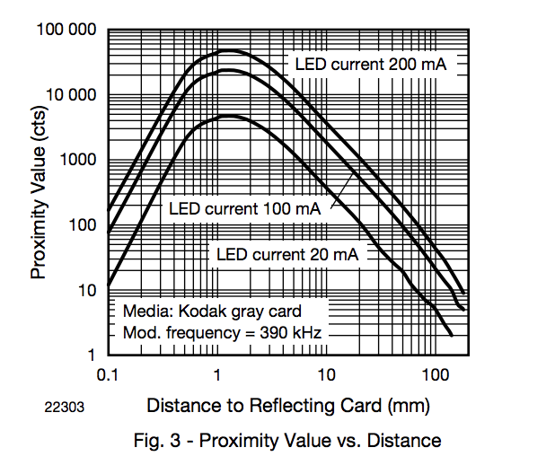
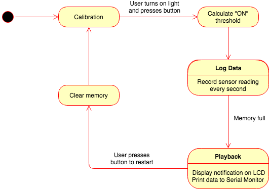

# Data Logger (and using cool sensors!)

*A lab report by Devon Bain.*

## In The Report

Include your responses to the bold questions on your own fork of [this lab report template](https://github.com/FAR-Lab/IDD-Fa18-Lab2). Include snippets of code that explain what you did. Deliverables are due next Tuesday. Post your lab reports as README.md pages on your GitHub, and post a link to that on your main class hub page.

For this lab, we will be experimenting with a variety of sensors, sending the data to the Arduino serial monitor, writing data to the EEPROM of the Arduino, and then playing the data back.

## Part A.  Writing to the Serial Monitor
 
**a. Based on the readings from the serial monitor, what is the range of the analog values being read?**

The range of analog values is 0-1023.
 
**b. How many bits of resolution does the analog to digital converter (ADC) on the Arduino have?**

It has 10 bits of resolution (1024 = 2^10).

## Part B. RGB LED

**How might you use this with only the parts in your kit? Show us your solution.**

To use the RGB LED, you connect the R, G, and B to a digital pin with a resistor in between (270 ohm is recommended), and connect the common anode to +5V. The color can then be set using code like [this](https://learn.adafruit.com/adafruit-arduino-lesson-3-rgb-leds/arduino-sketch).

## Part C. Voltage Varying Sensors 
 
### 1. FSR, Flex Sensor, Photo cell, Softpot

**a. What voltage values do you see from your force sensor?**

It goes from around 0-4mV (analog reading of 0-1) with no force applied to about 4.7V (analog reading 1000) when I fully press down on it. I used the code on [this page](https://learn.adafruit.com/force-sensitive-resistor-fsr/using-an-fsr) to test the fsr. 

**b. What kind of relationship does the voltage have as a function of the force applied? (e.g., linear?)**

It seems to be nonlinear (actually log/log according to the Adafruit FSR tutorial). When a small amount of force is applied, the voltage jumps to 1-2V (analog 400-500) very quickly. It then takes a much larger amount of force to reach 4.5-4.7V (analog 900-1000).

**c. Can you change the LED fading code values so that you get the full range of output voltages from the LED when using your FSR?**

You can get the analog reading from the FSR and use the `map` function to scale it to the LED's 0-255 range. The loop function becomes:

```
brightness = analogRead(A0);
brightness = map(brightness, 0, 1023, 0, 255);
analogWrite(led, brightness);
```

[Link to code](scripts/fade_fsr/fade_fsr.ino)

**d. What resistance do you need to have in series to get a reasonable range of voltages from each sensor?**

Flex sensor: 68k resistor gives an analog reading range of 13-750.

Photocell: 10k resistor gives a good range, although it is highly dependent on the amount of light.

Softpot: 10k resistor as suggested in the docs also works well.

**e. What kind of relationship does the resistance have as a function of stimulus? (e.g., linear?)**

Flex sensor: similar to the FSR, it seems to also be nonlinear, probably log-log as well.

Photo cell: also nonlinear. As light increases, photocell resistance decreases, as explained in the [tutorial](https://learn.adafruit.com/photocells/using-a-photocell).

Softpot: the resistance increases/decreases linearly with the position that is pressed.

### 2. Accelerometer
 
**a. Include your accelerometer read-out code in your write-up.**

[Link to code](scripts/accelerometer/accelerometer.ino)

### 3. IR Proximity Sensor

**a. Describe the voltage change over the sensing range of the sensor. A sketch of voltage vs. distance would work also. Does it match up with what you expect from the datasheet?**

Wnen the sensor is completely covered, proximity is 65535 and ambient is near 0. When the sensor is just sitting on the table with nothing covering it, proximity is about 2100 and ambient is about 380. The proximity increases nonlinearly faster the closer an object gets to the sensor. This seems to correspond to the information in the datasheet, which states that the proximity readings peak at 1mm. I don't notice the drop between 0-1mm, but might if I were using more precise equipment than a piece of paper.



**b. Upload your merged code to your lab report repository and link to it here.**

[Link to code](scripts/accel-proximity-merged/accel-proximity-merged.ino)

## Optional. Graphic Display

**Take a picture of your screen working insert it here!**

## Part D. Logging values to the EEPROM and reading them back
 
### 1. Reading and writing values to the Arduino EEPROM

**a. Does it matter what actions are assigned to which state? Why?**

Clearing the EEPROM can't be assigned to the middle state, because the value would be cleared before it could be read back.

**b. Why is the code here all in the setup() functions and not in the loop() functions?**

Reading, writing, and clearing only need to be performed once, not continuously. If they were in the loop() function, they would be needlessly performed over and over.

**c. How many byte-sized data samples can you store on the Atmega328?**

You can store 1024 byte-sized data samples on the Atmega328.

**d. How would you get analog data from the Arduino analog pins to be byte-sized? How about analog data from the I2C devices?**

To get the analog data to be byte-sized, you can use the `map()` function. The example code on [this page](https://www.arduino.cc/reference/en/language/functions/math/map/) will convert the value.

To get data from the I2C devices, you can use the [Wire library](https://www.arduino.cc/en/Reference/Wire) which facilitates communication with I2C devices.

**e. Alternately, how would we store the data if it were bigger than a byte? (hint: take a look at the [EEPROMPut](https://www.arduino.cc/en/Reference/EEPROMPut) example)**

If the data is bigger than a byte, we can use `EEPROM.put()` to write it, calculate the size of the data using `sizeof()` and manually advance the address for the next `put` based on the size.

**Upload your modified code that takes in analog values from your sensors and prints them back out to the Arduino Serial Monitor.**

[Link to code](scripts/accel-proximity-merged/accel-proximity-merged.ino)

### 2. Design your logger
 
**a. Insert here a copy of your final state diagram.**



### 3. Create your data logger!
 
**a. Record and upload a short demo video of your logger in action.**

[Link to video](https://youtu.be/uEfpmayNzHo)

[Link to code](scripts/datalogger)

My data logger uses the photocell sensor to monitor whether a lamp is on or off. The user places the logger near the lamp, and the logger records the amount of light every second\*. Each reading takes up 1 byte, so the logger can only hold about 17 minutes of data. If the user wanted to collect data over a longer time, the readings could be changed to every minute.

\*Note: in the video, the readings are every 1/100 second. Changing `delay(1000)` in the `state1loop` function will log a sensor reading every second. Changing to `delay(60000)` will log a reading every one minute.

Before entering the logging state, the device asks the user to turn the lamp on to calculate a threshold for the light being on vs. off. The threshold is calculated as the "on" reading multiplied by 0.75 to allow for some variation in ambient light. This works well with a single lamp in a room with consistent ambient light. It might not work well if the lamp is very dim or if the ambient light varies a lot -- more sophisticated math would be needed in that situation.

While logging, the LCD screen displays its prediction about whether the light is on or off. Once memory is full, it reads the recorded data and prints output to the serial monitor. It also displays summary statistics about how long the light was on vs. off, and how many times the switch was flipped. Why output to the serial monitor rather than the LCD screen? Although I could easily output the data to the LCD screen (just change `Serial.print` to `lcd.print`), this would be an inefficient way to view the data. I imagine the user wanting to save the data as a spreadsheet so they can analyze it later. The tab-separated output makes it easy to do that.

